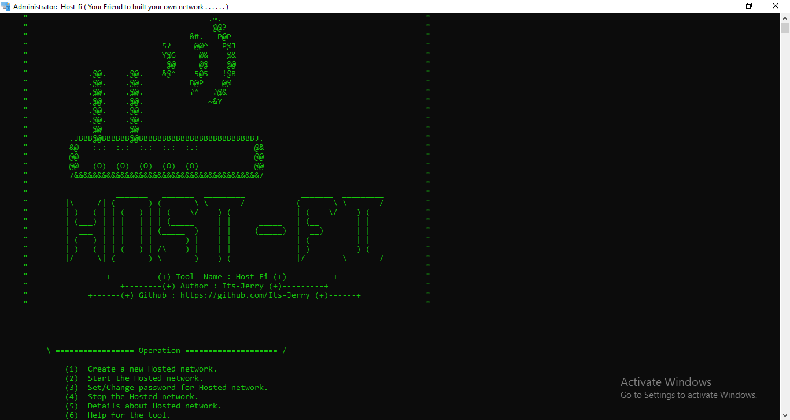

# Host-Fi 

Your friend to built your own local network.

# What is Host-Fi? 

The Host-Fi tool is basically used to create a hosted network or access point ( Hotspot ) in the Windows operating system. This tool can create a hosted network. And with the help of this we can easily establish a good connection with password security. 

## Features

 - User friendly interface.
 - Connect multiple devices.
 - Create a local access point.
 - Share data easily between devices.
 - Easily see the details about the connections.

## Testing 

This tool is tested on :

- Windows 7 ( New Version )
- Windows 8 ( All Versions )
- Windows 8.1 ( All Versions )
- Windows 10 ( All Versions )
- Windows 11 ( All versions )


## Authors

- [Its-Jerry](https://github.com/Its-Jerry)


## Installation

- Step 1. Clone the code by git clone. 

```bash  
git clone https://github.com/dipanshu0104/Host-Fi.git 
```
( You can also download the zip file directly. )

- Step 2. You can see the setup.bat file. Right click
        on it and Run it As Adminstrator mode. This 
        file setup the tool on your system.

- Step 3 Then You see a Host-Fi icon on your Desktop. 
         Then run it by Right click on it. 
         And Run It As Adminstrator or you can use shortcut key also.
         Now your tool will start.
    
## Screenshot


###    I hope you will use this tool very efficiently.
